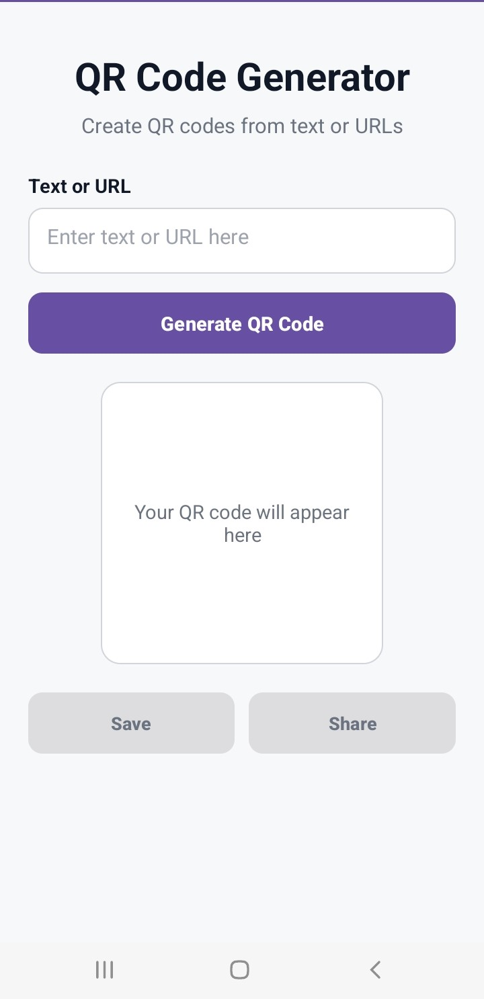
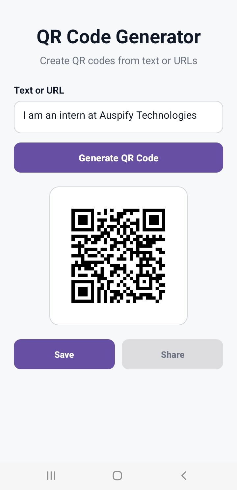
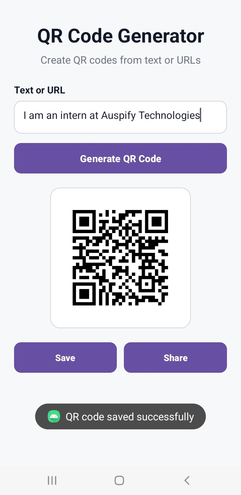
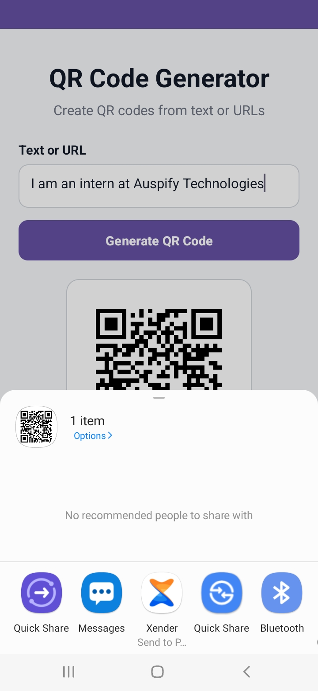

# QR Code Generator Android App

A simple and modern Android application that generates QR codes from
text or URLs and allows users to save and share the generated QR codes.

## Features

- Generate QR codes from text
- Generate QR codes from URLs
- Display generated QR codes
- Save QR codes as PNG images
- Share QR codes with other applications
- Input validation
- User feedback and error handling
- Responsive layout
- Accessible UI elements

## Technologies Used

- Kotlin
- Android Studio
- XML
- Android Views
- ZXing
- Android MediaStore
- Android Intent / Sharesheet

## How It Works

1. Enter text or a URL.
2. Tap **Generate QR Code**.
3. The application converts the input into a QR code.
4. The generated QR code is displayed on screen.
5. Tap **Save** to store the QR code on the device.
6. Tap **Share** to share the saved QR code through another application.

## QR Code Generation

The application uses the ZXing Core library to encode user input
into a QR code.

## Storage

Generated QR codes are saved as PNG images using Android's MediaStore
API.

## Sharing

The application uses Android's Intent system and Sharesheet to share
generated QR code images with compatible applications.

## Testing

The application was tested for:

- Empty input
- Spaces-only input
- Normal text
- URLs
- Special characters
- Long text
- Multiple QR code generation
- Multiple image saves
- Correct QR sharing
- Application restart
- Share cancellation
- QR scanning
- Rapid QR generation

## Screenshots

### Home Screen

### QR Code Generated

### QR Code Saved

### QR Code Sharing

## Author

Patrick Morrison
